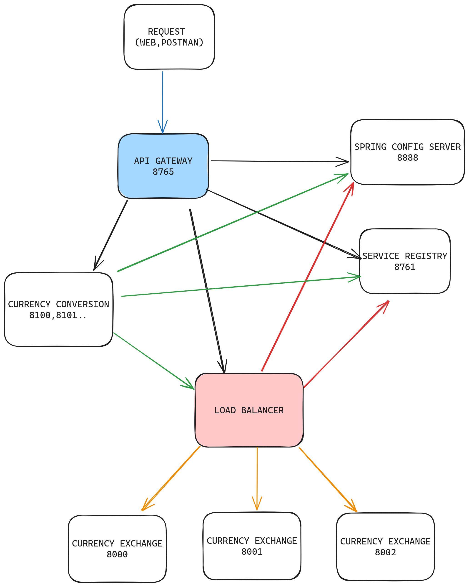
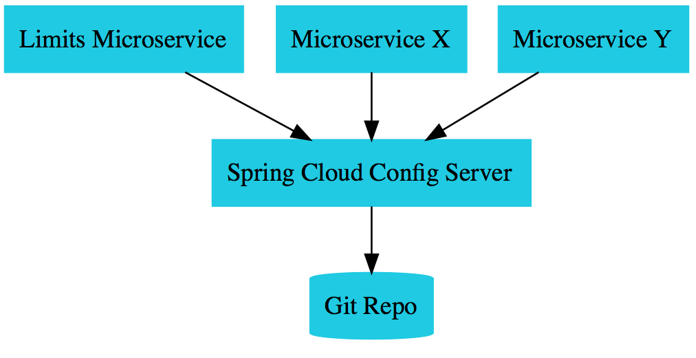
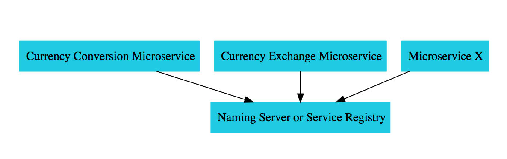
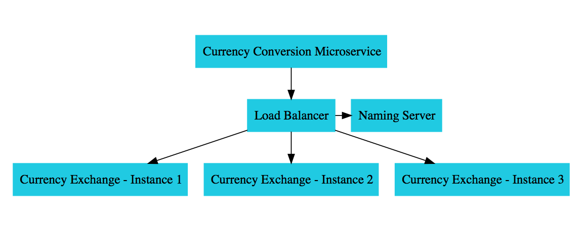

# Spring Microservices Playground

Welcome to my simple microservices playground crafted to showcase cutting-edge technologies in microservices architecture and Spring Cloud ecosystem. This project serves as an educational and practical resource, offering insights into the seamless integration of microservices and the utilization of powerful tools provided by Spring Cloud.


## Key Features

- Microservices Architecture.
- API Gateway: The inclusion of an API Gateway ensures a unified entry point for clients.
- Circuit Breaker Pattern, Rate Limitting, Retry on Failures, Bulkhead (Resilience4j).
- Eureka Discovery Service (Service Registry)
- Client-Side Load Balancing (Spring Cloud Load Balancer)
- Centralized Configuration (Spring Cloud Config).
- Spring Cloud Feign (Netflix Declarative approach for web service client)
- Hibranate / JPA & H2 in memory Database

## Diagrams
### High Level Overview 

### Spring Config 

### Spring Registry 

### Client-side Load Balancing 



## Run Locally

Clone the project

```bash
  git clone https://github.com/ahmeddbahaa/spring-microservices
```

Go to the project directory

```bash
  cd spring-microservices-demo
```

Install dependencies

```bash
  mvn clean install
```
Go to each service directory and run it 
```bash
  mvn spring-boot:run
```


## TODO 
- Use Docker containers and Kubernetes orchestration.
- Add API Reference.
- Step by step guide of how to configure and play around with API Gateway Routing, Retry on failure , Rate Limitting, Bulkhead of Resilience4j and load balancing.